Hi, I'm **Alshimaa** 👋
3rd-year Computer Science student at Tanta University, passionate about **Data Engineering, AI & Deep Learning**.
I build with **Python, SQL, Machine Learning, CNNs, Data Quality, and Automation** — from Emotion Recognition models to intelligent data systems.

